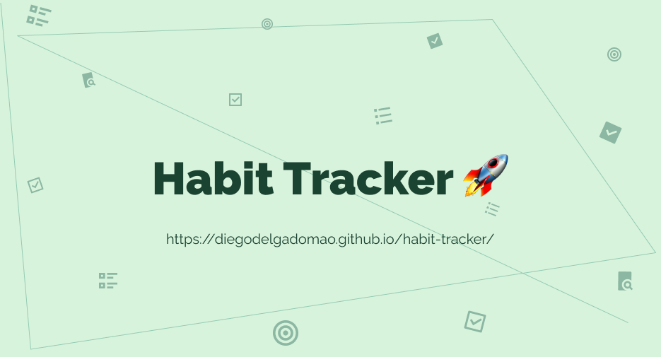

Habit Tracker es un aplicación web para hacer un seguimiento de tus hábitos diarios y así al final de la semana ver tu progreso, iterar y mejorar!

## Live demo

- [Demo](https://diegodelgadomao.github.io/habit-tracker/)

## Tecnologías

     

## Instalación

- clonar el repositorio: `git clone git@github.com:DiegoDelgadoMao/habit-tracker.git` (SSH)
- Ir al proyecto: `cd habit-tracker/`
- Instalar dependencias: `npm install`
- ejecutar: `npm run dev`

## Licencia

- MIT
